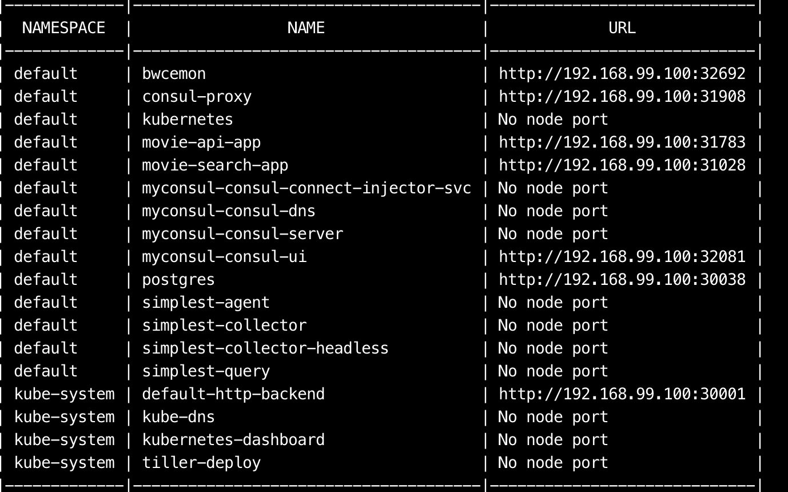
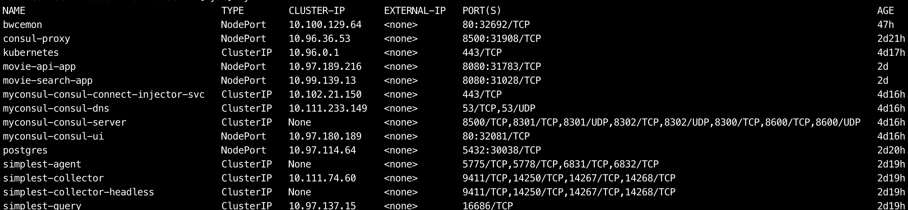
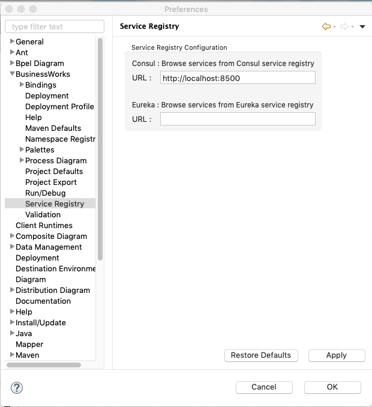
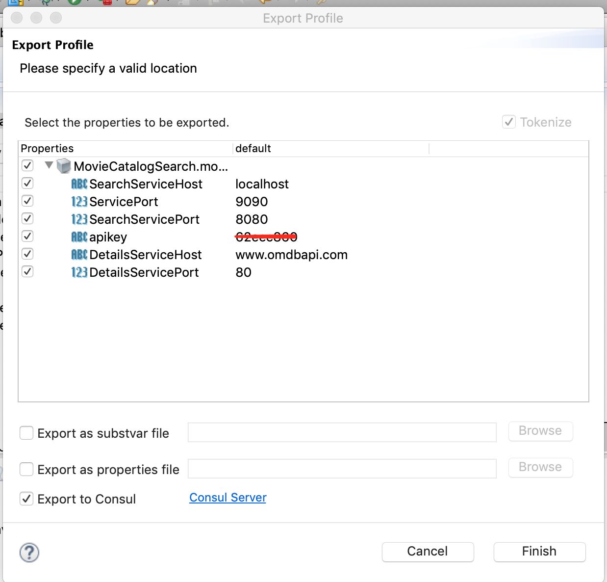
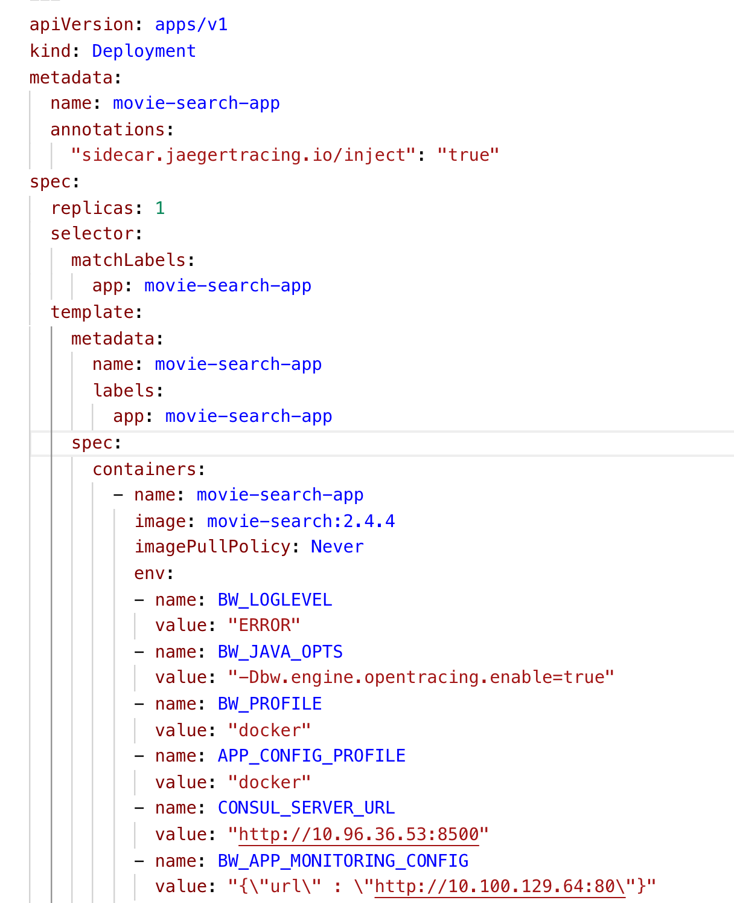

# BWCE Minikube Demo

This demo showcases how to use BWCE in a minikube environment and show some of the capabilities of BWCE. The below list of features can be demonstrated using this demo. This demo can be extended to show other features.

- Pushing configuration data (Application Properties) to Consul from Business Studio
- Configuration Management using Consul
- Registering services in Consul (Service Discovery and lookup)
- Unit Testing (assertions and mocking)
- Open Tracing with Jaeger
- Using BWCE mon for Process Monitoring, Gathering stats and Job data
- Dependency Viewer Features

All the dependent components run in minikube as well so this demo can be modified (by using different apps) easily to run on a standalone box without internet connectivity

## Prerequisites

- Minikube (v 1.2.0 was used to create this demo with the Virtual box driver)
- kubectl
- BusinessWorks Container Edition (v 2.4.4 or higher)
- helm (to install consul)
- Maven plugin (for Unit Testing features only)

### Installing Minikube
Install minikube using [the steps provided here](https://kubernetes.io/docs/tasks/tools/install-minikube/) . Ensure that you allocate enough memory to minikube. For creating this demo the following command was used (however lower memory can be allocated as well).
```
minikube start --memory 8192
```

Once minikube is installed follow the steps below to install dependent software.

### Installing consul in Minikube
Follow **Task 1** to [install consul from here](https://learn.hashicorp.com/consul/getting-started-k8s/minikube).

Note that consul does create a K8s service to query the UI however it doesn't create a service to reach the REST API directly. This bug has been reported. A workaround for this is to create a proxy service manually. Use the `consul-proxy.yaml` file to create a proxy which also uses a `NodePort` service so that Studio can push the application properties to Consul.

``` 
kubectl apply -f consul-proxy.yaml
```

### Installing Jaeger into minikube

We use the in-memory Jaeger implementation and the all-in-one image for this demo. To install Jaeger follow the documentation to use the `jaeger-operator` [Github Project here](https://github.com/jaegertracing/jaeger-operator). You can use the precreated `jaeger.yaml` file for step 2 to create a jaeger instance.

Jaeger UI is served on ingress if you haven't enabled ingress on minikube, you should enable it with the following command:

```
minikube addons enable ingress
```

Jaeger UI will be served on the minikube IP at port 80.

### Install a Postgres DB
You could use your own postgres DB but in order to keep this demo running local, you could use the postgresProxy.yaml file to deploy this DB in minikube

```
kubectl apply -f postgresProxy.yaml
```

This will also create a NodePort service so that Studio and PGAdmin can reach the database in the cluster.

### Create BWCE Base docker image
Given we are using minikube you don't need to have a docker daemon running on your machine. However you need to set the right environment variables so that docker CLI can use the minikube docker daemon.

```
eval $(minikube docker-env)
```

The above command will set the right environment variables. You will need to run this in every shell where you would be using the docker cli.

The next step will be to create a base bwce docker image. [Follow the steps here](https://docs.tibco.com/pub/bwce/2.4.4/doc/html/GUID-91EA80AA-08EF-4CB3-A6A7-E8551A441AC1.html) or [using the bwce-docker Github project](https://github.com/TIBCOSoftware/bwce-docker). You will need the bwce-runtime.zip for this step. The version used to create the demos is 2.4.4. If using a higher version please update the application Dockerfile.

### Build the application docker images
The application docker images can be built using the sample Dockerfile provided for each application. In case you wish to use your own application, you can use the sample Dockerfile and modify the EAR file name to the ear file name of your application.
For using the applications used in the demo follow the readme files in the Projects directory. 

If using Consul, please modify the consul IP address or use the service name instead in the yaml files.

### Deploy BWCE Mon
Download an unzip BWCE Mon package. Use the following commands to build the docker image and deploy it to the minikube cluster. **Please update the IP address of the postgres DB service in the yaml file.**

```
eval $(minikube docker-env ) 

docker build -t bwcemon:2.4.4

kubectl apply -f mon-k8s-manifest.yaml
```
This will deploy BWCE Mon and point to the postgres DB. 

## List of all services created
If all the apps and dependencies are created correctly you can use the following command to list all the services created
```
minikube service list
```
The output should be similar to 


As you can see that bwcemon, consul,postgres and the bw applications all have NodePort services in order to reach them from the host machine easily.

### ClusterIP vs NodePort

For most of our services ClusterIP and NodePort are enabled. NodePort is useful to connect to the services from outside the cluster. ClusterIP should be used to connect from inside the cluster. For example if an app needs to connect to consul, it can use the cluster ip.
To get the ClusterIP use kubectl
```
kubectl get svc
```
The output should look similar to:


## OMDB API

The two movie apps added in this repository allow you to search an API provided by www.omdbapi.com. Please create an account and get an API key to use for your demos. You can store the API key in consul for the apps to retrive it.

## Demos

### **Pushing Application Properties to Consul from Business Studio**

- Open Studio and open prefernces.
- Search for *Service Registries*
- Enter the NodePort Service associated
- Open the Application project Manifest file -> Properties tab
- Select a profile or create a new one e.g. docker.
- Click Export Profile and select the last option i.e. Consul Server and compelte the wizard.
- This will push the application properties to Consul as well as tokenzie them in the project

Screenshots below

Service registries preferences


Push to Consul


### **Open Tracing**

To add open tracing to any BWCE app just add the following two lines in the appropriate places. Once you enable opentracing, the jaeger-collector will automatically inject a jaeger-agent sidecar and start collecting traces.

Under the deployment metadata
``` yaml
 annotations:
    "sidecar.jaegertracing.io/inject": "true"
``` 
Under the `container env` section
``` yaml
- name: BW_JAVA_OPTS
            value: "-Dbw.engine.opentracing.enable=true"
```            
The manifest file should look similar to the screenshot below. Check the manifest yaml files for different projects in this repo for samples.


### **BWCE Mon**
Adding the below environment variable (with the right ClusterIP/servicename) for BWCE Mon will automatically bind the BWCE application to monitoring
``` yaml
 - name: BW_APP_MONITORING_CONFIG
            value: "{\"url\" : \"http://10.100.129.64:80\"}"
```
Check the open tracing manifest screenshot for where to add this env variable. Enable the Process Instrumentation stats and Process Monitor to start capturing job data in the postgres db.

### **Configuration Management using Consul**

Providing the right ClusterIP to your apps as an environment variable to read the values from consul. Check the open tracing screenshot for the manifest file.

```yaml
          - name: BW_PROFILE
            value: "docker"
          - name: APP_CONFIG_PROFILE
            value: "docker"
          - name: CONSUL_SERVER_URL
            value: "http://10.96.36.53:8500"
```

### **Unit Testing and other Studio features**

Although this particular setup doesn't need to be used, the apps supplied can be used to Mock the call to omdbapi.com as well as adding assertions. Use the `MovieAPI_ForUnitTesting.zip` as a base project to add mocks and assertions. [Read up more on Unit Testing here](https://github.com/TIBCOSoftware/bw6-plugin-maven/wiki/UnitTesting). The response is saved in SacredGamesResponse.xml.

Using the same project you can also demostrate Dependency Visualizer. To Invoke Dependency Visualizer to show Unused Resources in a project click on the application module -> Dependency Visualizer. Use the `Process.bwp` to demonstrate Dependencies and one of the schemas to demonstrate references. 

## Proposed Enhancements

- Use Maven to deploy to K8s
- Auto bind Monitoring service to BWCE App
- Build a CI pipeline using Jenkins in Minikube
- Explore K8s ConfigMaps and Secrets instead of Consul