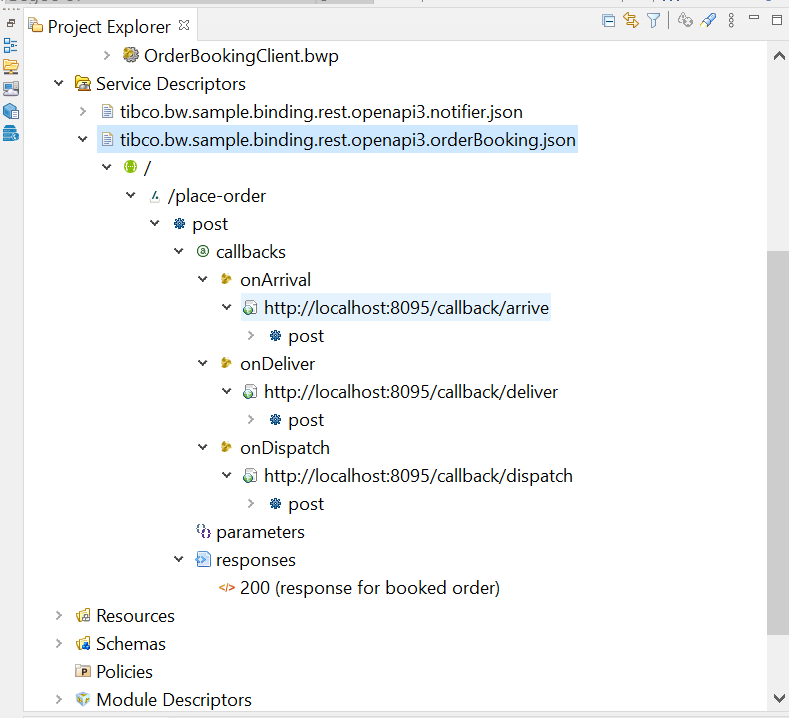
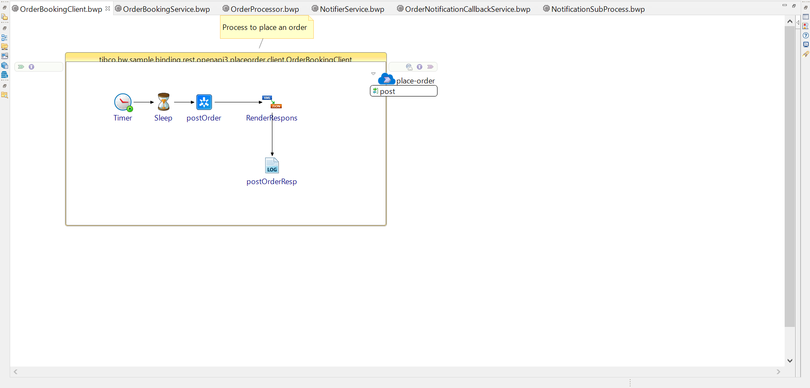
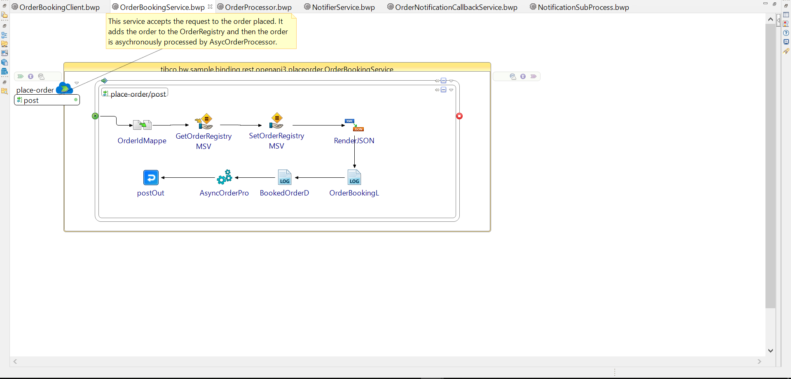
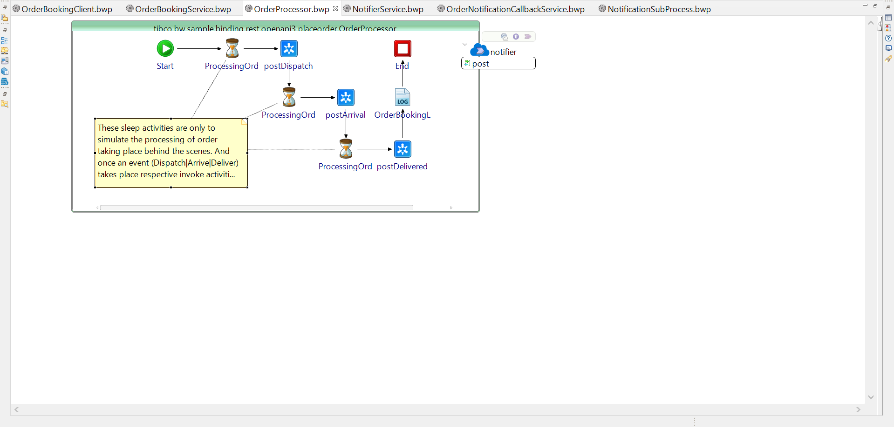
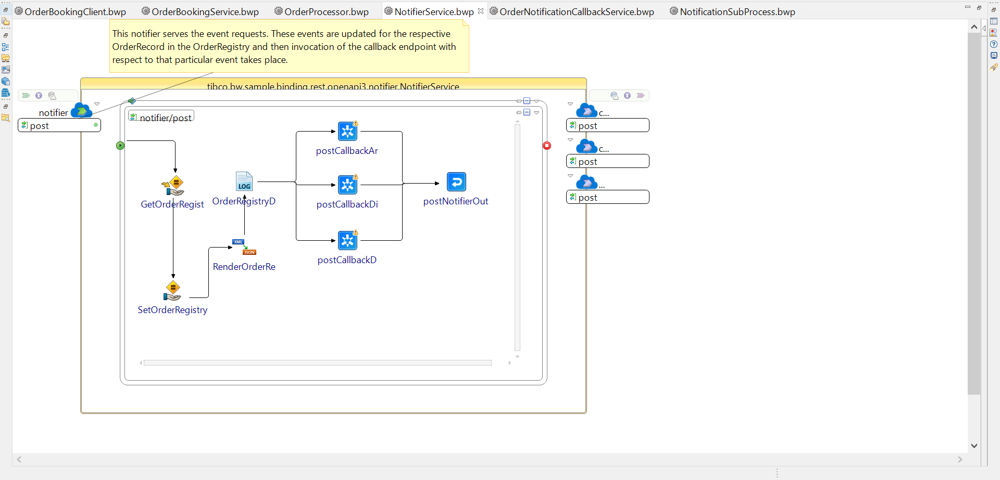
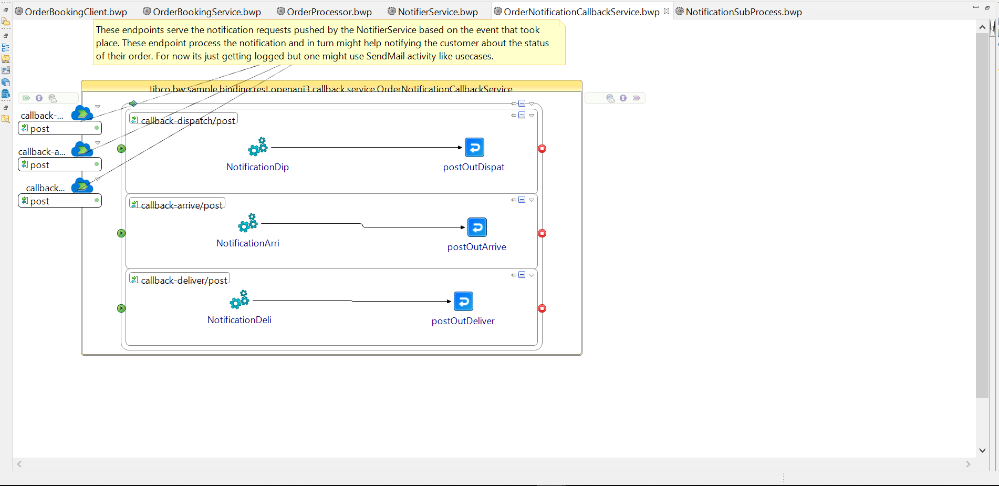
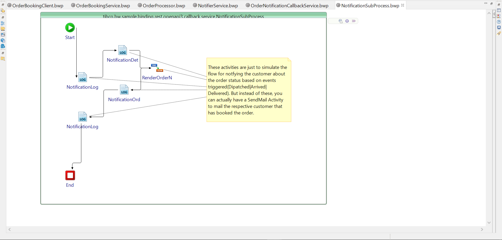

# OpenAPI3 Callbacks Sample:

## Context:

This Sample showcases how OpenAPI3 Callbacks based specs can be used in BW 6.8.0 version.
BW 6.8.0 provides below functionalities in subject to OAS3 Callbacks :

- Importing OAS3 specs having callbacks and parsing the same.
- Creating Reference Binding by dragging the callback URL and dropping it onto process canvas.
- Creating Service Binding by dragging the callback URL and dropping it onto process canvas.

## Summary of the sample:

This sample is about a simple order management workflow, where an order can be booked and the order processing related events will trigger notifications to callback service endpoints. The spec **_tibco.bw.sample.binding.rest.openapi3.orderBooking.json_** contains _/place-order_ path that has _POST_ operation configured with callbacks with 3 events as follows

- onDispatch
- onArrive
- onDeliver

The tree view in the below image can show the parsed swagger spec. The callback URLs have been dragged and dropped to create the Service and Reference bindings for the order booking and the callback processes. 
The notifier service process is just acting as a middleware to other flows.

## Sample Project workflows:

The workflow has been specified sequentially below.

### Order booking client:

**OrderBookingClient.bwp** process posts an order to the _/place-order_ endpoint implemented on **OrderBookingService.bwp**
SwaggerUI or any other REST Clients can also be used to post an order.

### Order booking service implementation:

**OrderBookingService.bwp** accepts all the order request and creates an _OrderRecord_ against it and appends it in the _OrderRegistry_ module shared variable.
After this the processing of the order is delegated to an **OrderProcessor.bwp** subprocess which works asynchronously and simultaneously the client is acknowledged with the response for booking the order accomodating an _orderId_ against that order.

### Order Processor:

OrderProcessor.bwp is a spawned subprocess which simulates the processing of order and the events taking place. So on occurrance of that event, the notifier service is invoked with the respective event details for that order.
The events are of type:

- Dispatched: this means that the order has been dispatched.
- Arrived: this means that the order has been arrived somewhere intermediate place.
- Delivered: this means that the order has been delivered.

### Notifier Service:

This service anticipate the event requests and invokes the notifications to respective callback endpoint.
Based on the event type the notification is sent to the respective callback endpoint.

### Callbacks Service:

The callback service bindings created on **OrderNotificationCallbackService.bwp** by dragging and dropping the callback URL nodes from tree view for each event types mentioned above, will serve the notifications for respective events.
For processing of notifications, the **NotificationSubProcess** is triggered which for now just logs the details but this can be totally extensible to scenarios like sending mails to respective customer regarding order events.

